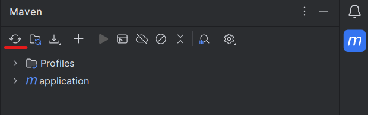
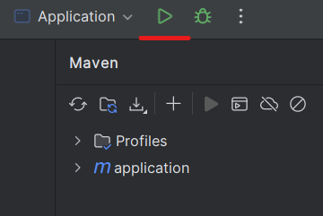
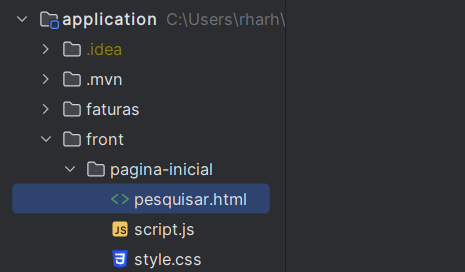
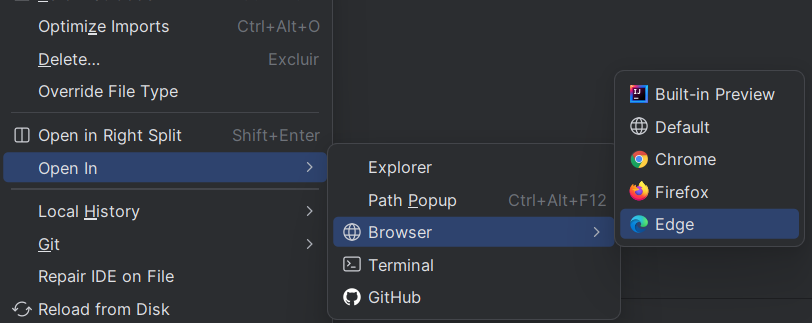

<h1> Teste Técnico Estágio - Elevaty </h1>

<p align="center">
  <a href="#requisitos"> Requisitos </a> •
  <a href="#instalacao"> Instalar </a> •
  <a href= "#run"> Como rodar </a> •
</p>


<h2> 🔨 Tecnologias/Ferramentas  </h2>


<h2 id= "requisitos" > Requisitos </h2>

* ☕ [Java](https://www.oracle.com/java/technologies/downloads/) instalado.


<h2 id= "instalacao"> Instalação </h2> 

```bash
# Pode-se clonar o repositório
 git clone https://github.com/Rharhuky/elevaty-challenge

 cd elevaty-challenge
```


* Em seguida, dentro do IntelliJ, instale as dependências com o Maven




<h2 id="run"> 🚀 Como rodar </h2>

* Na classe Application execute




* Selecione o arquivo **pesquisar.html** e clique com o botao direito:



* Por fim, abra no seu navegador

 

<h2> Owner 🫡</h2>

  * [Rharhuandrew Souza](https://www.linkedin.com/in/rharhuandrew-souza/)